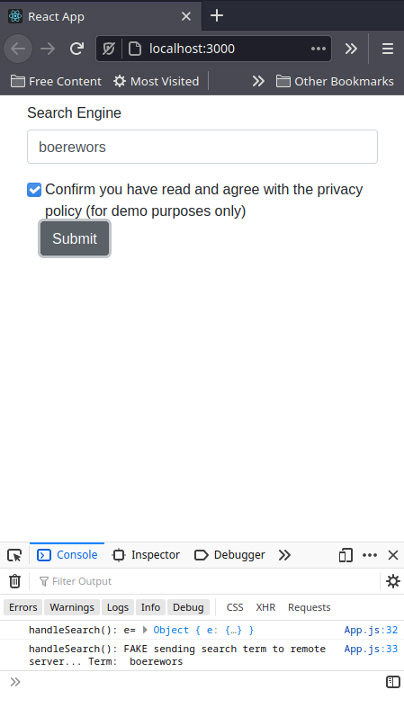
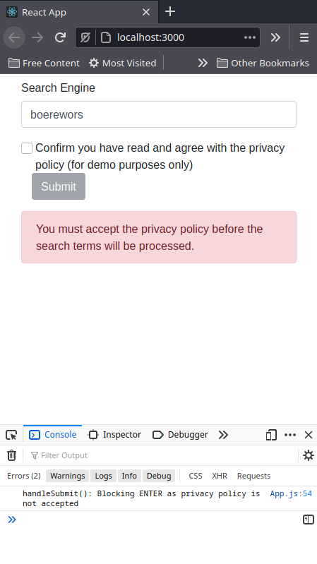

# Simple Form Demo in React with Reactstrap

Another short demo projects to highlight Form processing in [reactstrap](https://reactstrap.github.io/).

Inspiration for this experiment came from [this stackoverflow discussion](https://stackoverflow.com/questions/53746769/reactstrap-handle-input-implicit-submit)

# Quick start

Pick a directory, clone the repo, install dependencies and start the dev server:

```shell
$ git clone https://github.com/nicc777/react-reacstrap-forms-demo.git
$ cd react-reacstrap-forms-demo
$ yarn && yarn start
```

Use your web browsers development tools to monitor the console output.

Most of the action happens in `App.js`.

# Notes

You will notice you can also hit the ENTER key to attempt to submit the search query. However, when you do this without accepting the privacy policy, an alert message will be shown.

# Screenshots

#### Typical usage



#### Hitting ENTER when privacy policy is not accepted


